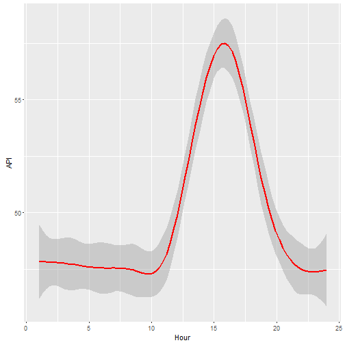

Developing Data Products - Course Project
========================================================
author: JH Chia
date: 23 Jan 2016

Introduction
========================================================

This Reproducible Pitch Presentation is the second part of the Course Project for the **Developing Data Products** module by Cousera and it must satisfy the following:

1. It must be done in Slidify or Rstudio Presenter
2. It must be 5 pages
3. It must be hosted on Github or Rpubs
4. It must contained some embedded R code that gets run when slidifying the document

The source code for this **_R Presentation_** is available at:

<https://github.com/chiajh/DevelopDataProduct_Presentation>


The Shiny Application
========================================================

The Shiny application, the first part of the Course Project is avalilable at:

<https://chiajh.shinyapps.io/API_Banting>

Source code for ui.R and server.R files are available on the GitHub:

<https://github.com/chiajh/DevelopDataProduct>

This Shiny application is to display the Air Pollutant Index (API) from year 2013 until 2015 for Banting area in Malaysia.

You can find out the details of this Shiny application by reading the "Read Me" section in navigation bar of this [application.] (https://chiajh.shinyapps.io/API_Banting)


Slide With Code - Display the API Dataset
========================================================

```r
dataAPI <-read.csv("API_Banting.csv")
head(dataAPI)
```

```
  Station.No Location       Date Hour API Pollutant
1         41  Banting 2013-08-01    1  66         *
2         41  Banting 2013-08-01    2  67         *
3         41  Banting 2013-08-01    3  67         *
4         41  Banting 2013-08-01    4  67         *
5         41  Banting 2013-08-01    5  67         *
6         41  Banting 2013-08-01    6  67         *
```


Slide With Code - Display the API Graph
========================================================

```r
library(ggplot2)
dataAPI <-read.csv("API_Banting.csv")
ggplot(data=dataAPI, aes(x=dataAPI$Hour, y=dataAPI$API))+geom_smooth(color="red")+labs(x="Hour", y="API")
```


